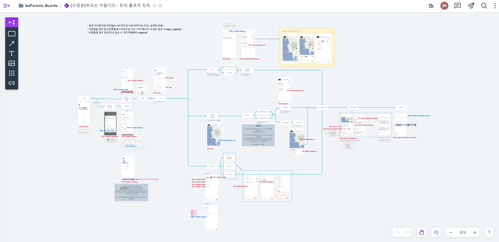
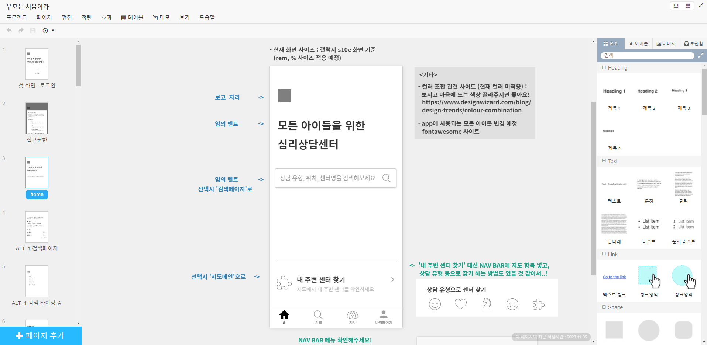
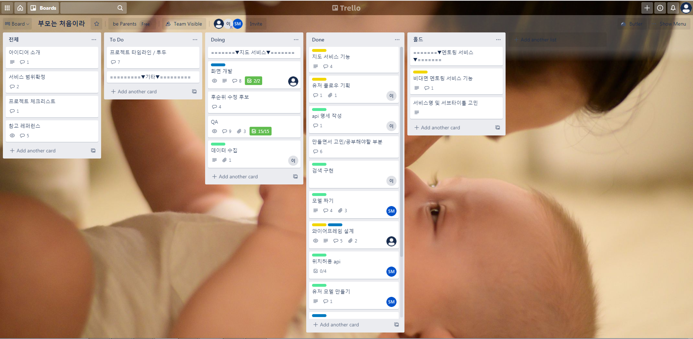

# 부모는 처음이라

## 1. Introduction

**부모는 처음이라**는 전국 아동심리 상담 센터 정보를 한 눈에 확인할 수 있는 웹 서비스입니다.
지도를 활용하여 내 주변 상담 센터 정보를 확인하고, 원하는 검색 키워드로 관련 상담 센터를 찾아보거나 해시태그 top10 목록을 추천 검색어로 확인할 수 있습니다.

### 담당 분야

총 3명이 팀을 이루어 진행했고, 와이어프레임 설계와 프론트엔드 작업을 담당했습니다.

### preview


## 2.Features
- 모바일 화면 사이즈를 중심으로 한 반응형 스타일링

- 이메일 주소로 간편한 회원가입

- 해시태그 top10을 활용한 검색어 추천 기능
- 검색 키워드 관련 센터 목록 찾기

- Naver Maps API를 이용한 주변 센터 위치 시각화 / 센터 요약정보 보기
- 거리순/별점순 센터 목록 정렬 기능

- 센터별 찜 저장하기 기능
- 센터별 별점을 포함한 리뷰 작성 및 수정, 삭제 기능
- 마이페이지에서 모아보는 나의 찜 센터 / 리뷰


## 3. 사용 스킬

### 1) Client

- ES2015+
- Naver Maps API
- HTML/CSS

### 2) Server

- python
- Django
- PostgreSQL

### 3) Deployment

- AWS (https://www.parents-mentor.com/) 

## 4. Installation
### Server
1. Django 기본 환경 셋팅 후 git을 클론합니다. 

```
# Django 기본 환경 셋팅 
$ python -m venv {가상환경이름}
$ cd {가상환경이름}

# 윈도우 사용자
$ source Scripts/activate
# Mac 사용자
$ source bin/activate

$ python -m pip install Django

# git clone 하기
$ git clone https://github.com/web-doh/beParents.git
$ cd beParents/

```

2. 필요 library들을 설치합니다.

```
# library 설치
$ python -m pip install django-mathfilters
$ python -m pip install psycopg2
$ python -m pip install haversine
$ python -m pip install requests
$ python -m pip install Pillow

```

3. vim을 사용하여 .zshrc 파일에 환경변수를 설정합니다. 

```
# vim을 사용하여 .zshrc 파일 열기
$ vim ~/.zshrc

# .zshrc 파일에 환경변수 저장
export SECRET_KEY='{Django의 secret key}'
export POSTGRES_SECRET_KEY='{PostgreSQL의 secret key}'
export NAVER_KEY='{Naver Maps API의 key}'

# 저장 후 터미널에서 shell 설정 반영
$ source ~/.zshrc

# 환경변수 저장 확인 방법 (결과가 제대로 안나오면 터미널 껐다가 다시 실행)
$ echo $SECRET_KEY

```

4. 서버를 실행하여 동작을 확인합니다.

```
# 서버 실행 후 확인
$ python manage.py runserver 

```


## 5. 프로젝트 관리 툴

- 유저플로우 차트 작성 : Whimsical
  

- 와이어프레임 설계 : Kakao oven
  

- 업무 관리 및 진행 상황 공유, QA 작성 : Trello
  

- API 작성 : Notion

- 코드 버전 관리 : Git / Github Desktop

- 업무 전반 공유 및 피드백: Slack (위의 모든 툴과 알림 연동)


## 6. 내가 구현한 대표적인 기능

### 0) 자주 쓰이는 기능 모듈화 

다양한 곳에서 활용되는 기능들은 모듈 형식으로 따로 작성했습니다. 
목록 정렬, 팝업 창, 맨 위로 가기 버튼 등과 관련한 기능이 해당됩니다. 


### 1) 회원가입 작성 양식 유효성 검사

브라우저 기본 내장 오류 메세지를 사용하지 않고, 직접 커스텀한 메세지를 띄워주는 기능을 구현했습니다. 회원 가입 양식의 데이터는 Django의 csrf token을 이용해 POST 방식으로 서버에 제출됩니다. 

- 필수 입력 사항 검사: 모든 필수 입력 사항을 작성했는지 확인 
- 형식 일치 검사: 정규표현식을 활용하여 지정된 형식과 작성된 형식이 일치한지 확인 
- 아이디 중복 확인 검사: '중복 확인' 버튼을 클릭하면 서버와 통신하여 중복 확인 
                       → 통과하지 못한 경우, 양식이 제출되지 못하게 방지 
- 비밀번호 확인 검사: 실패한 경우, 회원가입 양식이 제출되지 못하게 방지


### 2) 센터 목록을 지도 또는 목록 형식으로 보여주기

Geolocation API를 사용하여 사용자가 원할 경우 위치 정보를 받아 서버에 전달한 뒤, 서버로부터 주변 상담 센터 정보나 센터와 내 위치 간의 거리 정보를 받아옵니다.  

센터의 정보는 지도 또는 목록의 두 가지 방식으로 보여줍니다. 
지도 타입은 네이버 Maps API를 이용하여 센터 위치 정보를 효과적으로 표현했습니다. 
목록 타입은 거리순 혹은 평점순으로 정렬할 수 있습니다.

- 사용자가 지도의 중심을 옮기는 경우:
  - Maps API의 이벤트 리스너를 활용하여 '현 지도에서 검색하기' 버튼 띄우기   
  - 버튼을 클릭하면, 현재 지도의 위치를 중심으로 가까운 센터 목록을 다시 검색

- 지도 위의 특정 마커를 클릭한 경우:
  - 포토샵을 활용해 커스텀한 마커로 변경하여 보여주고,
  - Maps API에서 제공하는 정보창 대신 HTML로 커스텀한 센터 요약 정보창 보여주기 


### 3) 센터 상세 페이지에서 북마크 및 리뷰 작성과 관련한 기능 구현

Django의 is_authenticated 메서드로 로그인한 유저인지 확인하고, 로그인한 유저만 북마크나 리뷰 작성 기능을 사용할 수 있도록 했습니다. 로그인하지 않은 유저가 사용하고자 하는 경우 팝업창을 띄워 로그인 창으로 이동하거나 취소할 수 있도록 했습니다.  

- 긴 글 리뷰: 100자까지 보여주고, 아이콘을 활용해 전체 글을 펼쳐 볼 수 있는 기능
- 사용자가 작성한 리뷰: 편집 아이콘을 보여주어, 간편하게 편집 또는 삭제하기 가능
- 리뷰 편집: 뒤로가기 버튼 또는 수정 완료 버튼 클릭시, 팝업 창을 띄워 동작 확인   


### 4) 스타일링 : 반응형 웹 사이트 / 공통 사항 분리

rem, vw 등 상대적인 크기 단위와 미디어 쿼리를 활용하여 반응형으로 제작했습니다. 
스타일링에 필요한 공통 사항들은 common.css와 reset.css로 분리했습니다.
Navbar처럼 여러 화면에서 적용되는 HTML/CSS는 Django의 템플릿 확장 기능을 활용했습니다.   


## 7. 느낀 점

처음으로 진행한 프로젝트이다보니 높은 수준으로 코드를 작성했다고 생각하지 않습니다. 하지만 이번 경험을 토대로 Ajax 통신이나 써드파티 API의 기초적인 활용 방법을 익힐 수 있었고, 자바스크립트를 활용하여 프로젝트를 진행할 수 있는 기반을 다질 수 있었습니다.
 
아래는 추후에 수정하고자 하는 목록입니다. 

- 회원가입 오류 검사 핸들링 로직: 회원가입 페이지에서 오류 검사를 하는 로직을 더 간결하게 정리할 수 있을 것으로 보입니다. 유사한 검사 목록은 동일한 함수로 묶어 처리할 수 있도록 리팩토링할 예정입니다. 

- 테스트 작성 : 유닛 테스트를 진행하지 않았기 때문에 추후에 Jest, Enzyme 등을 배워 추가해볼 예정입니다.

- 데이터 통신 리팩토링 : 데이터 통신을 담당하는 부분은 클래스로 분리하여 유닛 테스트에 용이하고, 재사용성이 높아질 수 있도록 리팩토링할 예정입니다. 

- 리액트 및 타입스크립트 적용 : 리액트를 활용하여 프런트엔드 작업을 분리하고, 타입스크립트를 배워 좀 더 안전한 코드로 수정해볼 예정입니다.   


